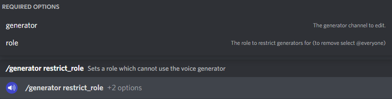

# Basic Setup

Setting up the bot may seem complicated at first, but this guide will take you through a step-by-step process.


Please note that you need `Administrator` permission to use all commands shown in this article.


**1.** [Invite the bot](https://discord.com/api/oauth2/authorize?client\_id=775025797034541107\&permissions=300944400\&scope=bot%20applications.commands) and select the server you wish to add it to.

.png>)

**2.** Once the bot is in your server, you can link your first channel and role, using the [`/voice link`](commands/commands/voice-linking.md#voice-link) command.

.png>)


It may take a minute for slash commands to be registered in your server.


**3.** You should see that when you join the voice channel, you are given the role that you specified.


If you are not given the role, you may need to check that the 'VC Roles' role is above the role you are trying to add, in the role list.


**4.** To unlink a voice channel and role, use the command [`/voice unlink`](commands/commands/voice-linking.md#voice-unlink)&#x20;

.png>)

**5.** Now you know how to link and unlink voice channels, let's set up audit logging in your server. Use the command [`/logging`](commands/commands/audit-logging.md#logging).

Whenever a member joins, leaves, or changes voice channels, a message will be sent here to let you know.

.png>)

**6.** As well as audit logging, you can set up TTS in your server now, using the [`/tts setup`](commands/commands/tts-commands.md#ttssetup) command. You can choose to enable or disable TTS with this command, and whether or not to lock it to a certain role.

.png>)

### That's it! You have completed the basic server setup!

To see what else the bot can do, view the [Commands page](commands/commands/)
