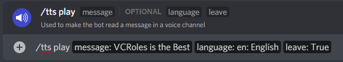

# TTS Commands

TTS is a feature of the bot, where it will join your voice channel, and read out the message that you gave it. It has options for a selection of languages and is great for users who don't have a mic but still want to be heard in the voice call.

## /tts setup

With this command, you can choose to enable or disable TTS with this command, and whether or not to lock it to a certain role. You can also select whether by default the bot will leave the voice channel after reading the message

## /tts play

The main TTS command for your users. With this command, you can give the bot a message to read out, and you also have the ability to specify which language the bot reads the message in, and also, whether or not the bot leaves the channel after reading the message.

You need to be in a voice channel to use this command, and if a role was specified during setup, to have that role.

## /tts stop

This command stops the current TTS message & makes the bot leave the voice channel.

.png>)
