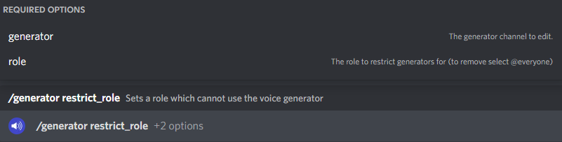

# Voice Channel Generators

A voice channel generator is a useful way to manage voice channels in your server and keep the channel list tidy.

The basic idea of a voice channel generator is that when a user joins the channel, a new, unique channel is created just for them. Other server members can join this channel and use it just like any other channel. When all users leave, the channel is deleted to keep your channel list tidy.

Generators are highly customisable, giving users the ability to edit their channel however they like, such as locking, hiding, renaming and editing which roles/members can join their channel for ultimate control.

The commands listed below are for **admins** setting up the bot, if you want to discover the **user** commands, see the [Voice Generator Interface](../../voice-generator-interface.md) & [Interface Commands](interface-commands.md)


All servers get access to one free generator, unlimited access can be unlocked [with Premium](https://cde90.gumroad.com/l/vcroles)


## Creation Commands:

### /generator create default

This command creates a default voice channel generator - the same as the previous commands - where when a member joins the creation channel, a new channel is created with their username as the name.

<figure><figcaption></figcaption></figure>

#### Options:

* `user_editable` - whether you want users to be able to edit/modify their generated channel.
* `channel_limit` - the maximum number of generated channels you want
* `category_name` - the name of the category you want the generator & generated channels to be in. This can be changed manually later without problems.
* `voice_channel_name` - the name of the generator voice channel (the voice channel members need to join to get their own private channel)
* `create_interface_channel` - whether to create an interface channel (if this is not set it defaults to the value of `user_editable`
* `interface_channel_name` - the name of the interface channel [(see here)](../../voice-generator-interface.md). This can be changed manually later.
* `default_user_limit` - the default user limit (the number of users allowed in the generated channel by default)

### /generator create numbered

This command will create a voice generator which makes numbered channels. These are channels which when generated are given a number.

<figure><figcaption></figcaption></figure>

#### Options:

* `generated_channel_name` - the name of the generated channel (the number of the channel will be added after this e.g. 'Name' would become 'Name #1', 'Name #2' etc.)
* All other options are [explained above](voice-channel-generators.md#options)

### /generator create clone

This command will create a voice generator which clones the joinable channel when a user joins. This means options such as member limit, permissions, name and bitrate automatically apply to the created channel.

<figure><figcaption></figcaption></figure>

#### Options:

* `voice_channel_name` - the behaviour here is slightly different to the default generator since this channel is cloned, the generated channel's name becomes '\[`voice_channel_name`] #1' with #1 being the number of the voice channel.
* All other options are [explained above](voice-channel-generators.md#options)

### /generator create custom\_name

This command will create a voice generator which makes channels based on a custom name you provide.

<figure><figcaption></figcaption></figure>

#### Options:

* `generated_channel_name` - the name of the generated channels. To make this more customisable, you can use variables in the name - $username is replaced with the username of the user, and $count is replaced with the number of the voice channel.
* All other options are [explained above](voice-channel-generators.md#options)

## Generator Removal:

### /generator remove

You can use this command to remove a voice channel generator in your server. You must specify the generator channel of the generator to remove (this is the channel members join for a channel to be made)&#x20;

<figure><figcaption></figcaption></figure>

### /generator force\_remove

You can use this command when you don't know which channel is setup as the generator. It will remove all generators linked with your channel from the database **it will NOT delete** the actual channels from your server, just make them non-functional.

## More Commands:

### /generator toggle

This command toggles a default option for a voice generator.

<figure><figcaption></figcaption></figure>

#### Options:

* `generator` - the generator channel of the generator to remove (this is the channel members join for a channel to be made)
* `option` - the available options are: `LOCK` (locks the generated channel), `HIDE` (hides the generated channel), `TEXT` (creates a text channel with the voice channel), `EDITABLE` (whether users can edit their generated channel), `OWNER` (whether to track the owner of a channel, and enforce that only owners can edit a voice channel)
* `state` - what to set the option above to (True enable, False disable)

### /generator options

Lists the options set for a generator channel. (options explained above)

<figure><figcaption></figcaption></figure>

### /generator role

Sets the default role the bot edits permissions for e.g. when locking a channel this is the role permissions will be edited for. By default this is the @everyone role.

<figure><figcaption></figcaption></figure>

### /generator restrict\_role

Sets a role which cannot use the voice channel generator - when a user with that role joins, they will be disconnected from the generated channel, and they won't be able to join newly created channels either.

<figure><figcaption></figcaption></figure>

### /generator hide\_at\_limit

Controls whether the generator channel is hidden when the set channel limit is reached.


Note this is a [Premium Only](https://cde90.gumroad.com/l/vcroles) feature


<figure><figcaption></figcaption></figure>
